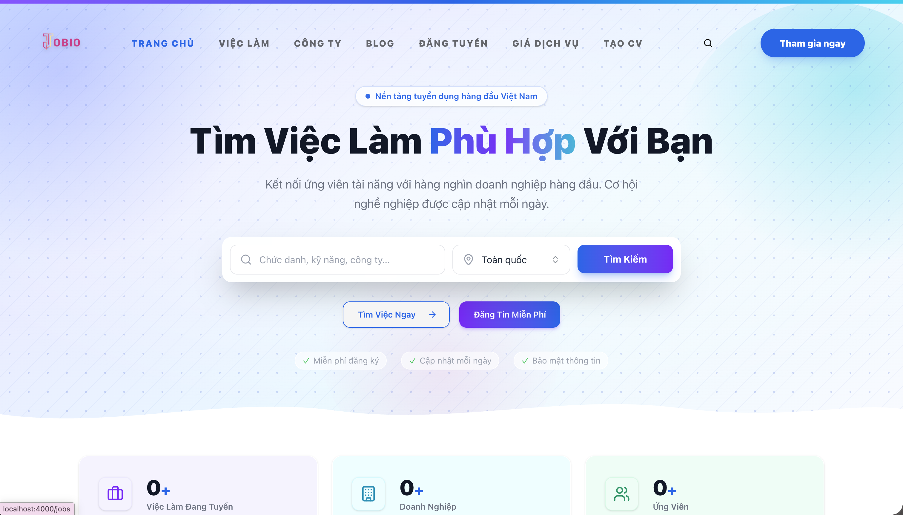
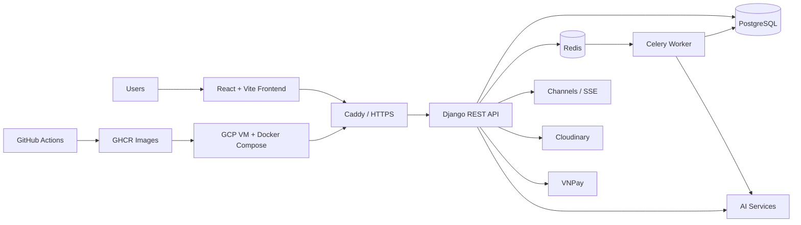

# JOBIO

  

  <h3>Nền tảng tuyển dụng thông minh kết nối ứng viên, doanh nghiệp và đội ngũ quản trị trên một hệ sinh thái fullstack.</h3>

  

    
    
    
    
    
    
  

  
   
  <em>Giao diện trang chủ JOBIO - nền tảng kết nối ứng viên và doanh nghiệp.</em>

## Tổng Quan

JOBIO là hệ thống tuyển dụng fullstack được xây dựng để số hóa hành trình tìm việc và tuyển dụng: từ khám phá cơ hội nghề nghiệp, tạo hồ sơ/CV, ứng tuyển, quản lý ứng viên, sắp xếp phỏng vấn, thanh toán gói dịch vụ cho tới quản trị vận hành nền tảng.

Dự án hướng tới ba nhóm người dùng chính:

| Nhóm người dùng | Giá trị cốt lõi |
| --- | --- |
| Ứng viên | Tìm kiếm việc làm, quản lý hồ sơ, tạo CV, theo dõi ứng tuyển và nhận gợi ý phù hợp. |
| Doanh nghiệp | Xây dựng hồ sơ công ty, đăng tin tuyển dụng, quản lý pipeline ứng viên, phỏng vấn và phân tích hiệu quả tuyển dụng. |
| Quản trị viên | Kiểm soát người dùng, nội dung, dữ liệu nền tảng, báo cáo vi phạm, tài chính và cấu hình hệ thống. |

## Tính Năng Nổi Bật

| Khu vực | Tính năng chính |
| --- | --- |
| Public site | Trang chủ tuyển dụng, tìm việc, khám phá công ty, blog, bảng giá và trang HR solutions. |
| Candidate | Hồ sơ ứng viên, CV Builder, quản lý CV, ứng tuyển, lưu việc, lịch phỏng vấn, thông báo và gợi ý việc làm. |
| Company | Hồ sơ doanh nghiệp, đăng tin tuyển dụng, quản lý tin, quản lý ứng viên, lịch phỏng vấn, analytics, billing và thanh toán VNPay. |
| Admin | Dashboard quản trị, quản lý người dùng, kiểm duyệt nội dung, quản lý tin tuyển dụng, báo cáo vi phạm, master data và tài chính. |

## Kiến Trúc Hệ Thống

JOBIO tách rõ frontend, backend API, database, cache, background worker và lớp triển khai production. Kiến trúc này giúp hệ thống vừa phục vụ trải nghiệm web hiện đại, vừa hỗ trợ các tác vụ nền như phân tích CV, thông báo, thanh toán và xử lý dữ liệu tuyển dụng.

## Tech Stack

| Nhóm | Công nghệ |
| --- | --- |
| Frontend | React 19, TypeScript, Vite, Tailwind CSS 4, TanStack Query, React Router 7, Zustand, Framer Motion, GSAP |
| Backend | Django 5.2, Django REST Framework, SimpleJWT, PostgreSQL, Redis, Celery, Channels, Daphne, django-eventstream |
| Integrations | Cloudinary, Google OAuth, OpenAI/Groq/Gemini-related AI, VNPay, WebAuthn/Passkey |
| DevOps | Docker, Docker Compose, Caddy, GitHub Actions, GHCR, GCP VM |

## Module Chính

| Module | Vai trò |
| --- | --- |
| Core Users | Tài khoản, phân quyền, xác thực JWT, social login và passkey. |
| Candidate | Hồ sơ ứng viên, học vấn, kinh nghiệm, kỹ năng, chứng chỉ, ngôn ngữ, dự án và CV. |
| Company | Hồ sơ công ty, ngành nghề, phúc lợi, media và thông tin thương hiệu tuyển dụng. |
| Recruitment | Việc làm, kỹ năng yêu cầu, địa điểm, ứng tuyển, lịch sử trạng thái, phỏng vấn và việc đã lưu. |
| Billing | Gói dịch vụ, đăng ký, giao dịch, phương thức thanh toán và tích hợp VNPay. |
| Communication | Thông báo, loại thông báo, job alerts và matching theo nhu cầu ứng viên. |
| Blog | Nội dung blog, danh mục, thẻ và quản lý bài viết. |
| System | Cấu hình hệ thống, nhật ký hoạt động, upload file, báo cáo vi phạm và dữ liệu quản trị. |
| Analytics | Báo cáo, thống kê dashboard, phân tích tuyển dụng và dữ liệu vận hành. |
| Geography | Tỉnh/thành phố, xã/phường và địa chỉ dùng cho công ty, ứng viên, việc làm. |

## Chất Lượng & Triển Khai

JOBIO có pipeline CI/CD tách rõ kiểm tra chất lượng và triển khai production:

- CI kiểm tra backend lint, backend tests, frontend lint, TypeScript type-check và production build.
- CD đóng gói backend/frontend thành Docker image, đẩy lên GHCR và triển khai lên GCP VM.
- Production stack sử dụng Docker Compose, Caddy reverse proxy, PostgreSQL, Redis, Celery worker và healthcheck cho các service chính.
- Workflow seed demo data hỗ trợ kiểm tra dữ liệu mẫu trước khi import lên môi trường production.

## Tài Liệu Liên Quan

| Tài liệu | Nội dung |
| --- | --- |
| [Backend README](backend/README.md) | Ghi chú chuyên biệt cho Django API và các module backend. |
| [Frontend README](frontend/README.md) | Ghi chú chuyên biệt cho React/Vite frontend. |
| [DB Description](Docs/DB_Description.md) | Mô tả chức năng các bảng theo từng module nghiệp vụ. |
| [Database Notes](Docs/DataBase.md) | Tài liệu cơ sở dữ liệu và cấu trúc dữ liệu liên quan. |
| [VNPay Testing](Docs/TestVNPay.md) | Ghi chú kiểm thử luồng thanh toán VNPay. |
| [Dataset README](DataSet/README.md) | Tài liệu dữ liệu mẫu và dữ liệu seed/demo. |

## Nhóm Phát Triển

- CapKimKhanh
- DangNgocHuy

## License

JOBIO được phát hành theo giấy phép [MIT](LICENSE.txt).
