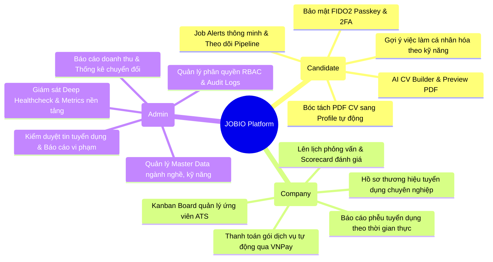
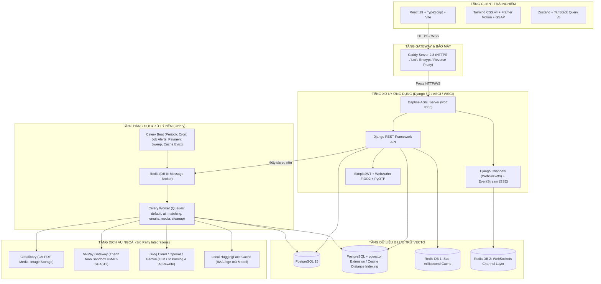
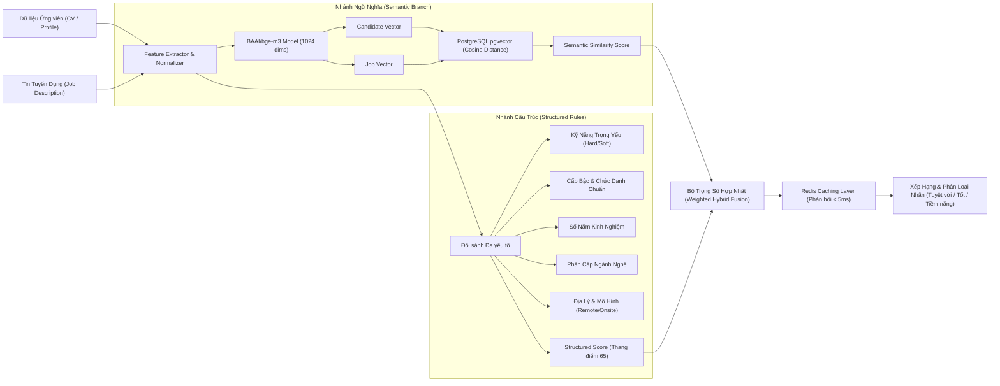
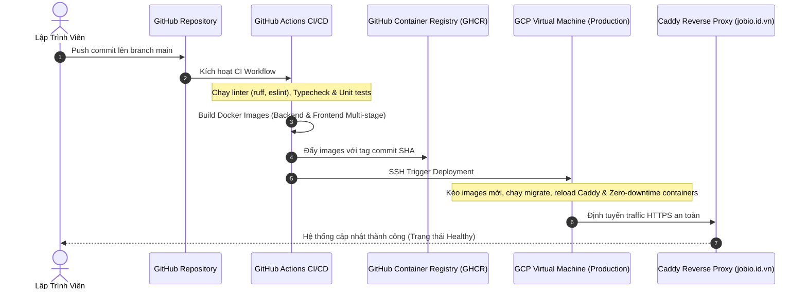

# JOBIO — Nền Tảng Tuyển Dụng Thông Minh

  

  

    <strong>Hệ sinh thái tuyển dụng Fullstack thế hệ mới tích hợp Hybrid Semantic Recommendation, AI CV Parsing và kiến trúc phân tán cấp Enterprise.</strong>
  

  

    
    
    
    
    
    
    
    
    
    
  

  

    <a href="#-kiến-trúc-hệ-thống">Kiến Trúc</a> •
    <a href="#-công-nghệ-ai--gợi-ý-việc-làm-đột-phá">AI & Khớp Nối</a> •
    <a href="#-tính-năng-chi-tiết-theo-phân-hệ">Tính Năng</a> •
    <a href="#-tech-stack-toàn-diện">Tech Stack</a> •
    <a href="#-ci-cd--vận-hành-production">CI/CD</a>
  

---

## 🌟 Tổng Quan Dự Án

**JOBIO** là nền tảng tuyển dụng thông minh được thiết kế theo chuẩn doanh nghiệp nhằm giải quyết triệt để sự đứt gãy thông tin giữa **Ứng viên tìm việc**, **Nhà tuyển dụng săn nhân tài** và **Đội ngũ kiểm duyệt vận hành sàn**.

Thay vì chỉ lọc từ khóa cứng nhắc (Keyword Search thông thường), JOBIO ứng dụng **mô hình khuyến nghị lai (Hybrid Recommendation)** kết hợp giữa **Vector Embeddings ngữ nghĩa (Semantic)** và **Đối sánh thuộc tính cấu trúc (Structured Matching)**, cùng hệ thống **CV Parser bằng trí tuệ nhân tạo (LLM)** giúp tự động hóa quá trình ứng tuyển và sàng lọc hồ sơ chỉ trong vài giây.

### Giá Trị Cốt Lõi Cho 3 Nhóm Đối Tượng:

```mermaid
mindmap
  root((JOBIO Platform))
    Ứng Viên (Candidate)
      AI CV Builder & Preview PDF
      Bóc tách PDF CV sang Profile tự động
      Gợi ý việc làm cá nhân hóa theo kỹ năng
      Job Alerts thông minh & Theo dõi Pipeline
      Bảo mật FIDO2 Passkey & 2FA
    Doanh Nghiệp (Company)
      Hồ sơ thương hiệu tuyển dụng chuyên nghiệp
      Kanban Board quản lý ứng viên ATS
      Lên lịch phỏng vấn & Scorecard đánh giá
      Thanh toán gói dịch vụ tự động qua VNPay
      Báo cáo phễu tuyển dụng theo thời gian thực
    Quản Trị Viên (Admin)
      Kiểm duyệt tin tuyển dụng & Báo cáo vi phạm
      Quản lý phân quyền RBAC & Audit Logs
      Quản lý Master Data ngành nghề, kỹ năng
      Giám sát Deep Healthcheck & Metrics nền tảng
      Báo cáo doanh thu & Thống kê chuyển đổi
```

---

## 🏛️ Kiến Trúc Hệ Thống Chuyên Sâu

JOBIO áp dụng kiến trúc Micro-Monolith phân tầng rõ rệt, kết hợp giữa luồng xử lý đồng bộ (Sync REST API), luồng thời gian thực (WebSockets/SSE) và hàng đợi tác vụ nền bất đồng bộ (Celery Distributed Task Queue).

```mermaid
flowchart TB
    subgraph Clients["TẦNG CLIENT TRẢI NGHIỆM"]
        Web["React 19 + TypeScript + Vite"]
        Styling["Tailwind CSS v4 + Framer Motion + GSAP"]
        State["Zustand + TanStack Query v5"]
    end

    subgraph Gateway["TẦNG GATEWAY & BẢO MẬT"]
        Caddy["Caddy Server 2.8 (HTTPS / Let's Encrypt / Reverse Proxy)"]
    end

    subgraph CoreBackend["TẦNG XỬ LÝ ỨNG DỤNG (Django 5.2 / ASGI / WSGI)"]
        Daphne["Daphne ASGI Server (Port 8000)"]
        DRF["Django REST Framework API"]
        Realtime["Django Channels (WebSockets) + EventStream (SSE)"]
        AuthModule["SimpleJWT + WebAuthn FIDO2 + PyOTP"]
    end

    subgraph TaskQueue["TẦNG HÀNG ĐỢI & XỬ LÝ NỀN (Celery)"]
        Broker["Redis (DB 0: Message Broker)"]
        Worker["Celery Worker (Queues: default, ai, matching, emails, media, cleanup)"]
        Beat["Celery Beat (Periodic Cron: Job Alerts, Payment Sweep, Cache Evict)"]
    end

    subgraph DataStorage["TẦNG DỮ LIỆU & LƯU TRỮ VECTO"]
        Postgres[(PostgreSQL 15)]
        PGVector[(PostgreSQL + pgvector Extension / Cosine Distance Indexing)]
        RedisCache[(Redis DB 1: Sub-millisecond Cache)]
        RedisChannel[(Redis DB 2: WebSockets Channel Layer)]
    end

    subgraph ExternalServices["TẦNG DỊCH VỤ NGOÀI (3rd Party Integrations)"]
        Cloudinary["Cloudinary (CV PDF, Media, Image Storage)"]
        VNPay["VNPay Gateway (Thanh toán Sandbox HMAC-SHA512)"]
        GroqLLM["Groq Cloud / OpenAI / Gemini (LLM CV Parsing & AI Rewrite)"]
        LocalModel["Local HuggingFace Cache (BAAI/bge-m3 Model)"]
    end

    %% Client flows
    Web -->|HTTPS / WSS| Caddy
    Caddy -->|Proxy HTTP/WS| Daphne
    Daphne --> DRF
    Daphne --> Realtime

    %% API flows
    DRF --> Postgres
    DRF --> PGVector
    DRF --> RedisCache
    DRF --> AuthModule
    DRF -->|Đẩy tác vụ nền| Broker
    Realtime --> RedisChannel

    %% Task Queue flows
    Broker --> Worker
    Beat --> Broker
    Worker --> Postgres
    Worker --> PGVector
    Worker --> Cloudinary
    Worker --> GroqLLM
    Worker --> LocalModel
    Worker --> VNPay
```

---

## 🧠 Công Nghệ AI & Gợi Ý Việc Làm Đột Phá

### 1. Hybrid Semantic-Structured Recommendation Engine

Hệ thống kết hợp 2 trường phái giải thuật:

```mermaid
flowchart LR
    CandidateData["Dữ liệu Ứng viên (CV / Profile)"] --> Extractor["Feature Extractor & Normalizer"]
    JobData["Tin Tuyển Dụng (Job Description)"] --> Extractor

    subgraph SemanticPath["Nhánh Ngữ Nghĩa (Semantic Branch)"]
        Extractor --> EmbeddingGen["BAAI/bge-m3 Model (1024 dims)"]
        EmbeddingGen --> VectorCand[Candidate Vector]
        EmbeddingGen --> VectorJob[Job Vector]
        VectorCand & VectorJob --> CosineDist["PostgreSQL pgvector (Cosine Distance)"]
        CosineDist --> SemanticScore["Semantic Similarity Score"]
    end

    subgraph StructuredPath["Nhánh Cấu Trúc (Structured Rules)"]
        Extractor --> MatchRules["Đối sánh Đa yếu tố"]
        MatchRules --> SkillScore["Kỹ Năng Trọng Yếu (Hard/Soft)"]
        MatchRules --> TitleScore["Cấp Bậc & Chức Danh Chuẩn"]
        MatchRules --> ExpScore["Số Năm Kinh Nghiệm"]
        MatchRules --> CatScore["Phân Cấp Ngành Nghề"]
        MatchRules --> LocScore["Địa Lý & Mô Hình (Remote/Onsite)"]
        MatchRules --> StructScore["Structured Score (Thang điểm 65)"]
    end

    SemanticScore & StructScore --> HybridFusion["Bộ Trọng Số Hợp Nhất (Weighted Hybrid Fusion)"]
    HybridFusion --> RedisStore["Redis Caching Layer (Phản hồi < 5ms)"]
    RedisStore --> FinalRank["Xếp Hạng & Phân Loại Nhãn (Tuyệt vời / Tốt / Tiềm năng)"]
```

#### Chi tiết tính điểm Hybrid Match:
- **Semantic Similarity**: Sử dụng vector nhúng **1024 chiều** từ mô hình ngôn ngữ lớn `BAAI/bge-m3`, so khớp khoảng cách Cosine trên chỉ mục vector PostgreSQL `pgvector`.
- **Structured Matching**:
  - **Kỹ năng (Skill Match)**: Phân tách rõ kỹ năng bắt buộc (*Required*) và kỹ năng ưu tiên (*Preferred*), tính toán theo độ trùng khớp danh mục chuẩn hóa.
  - **Chức danh (Title Normalization)**: Chuẩn hóa chức danh về Canonical Taxonomy để so khớp ngữ cảnh nghề nghiệp.
  - **Kinh nghiệm (Seniority & Experience)**: So sánh số năm kinh nghiệm thực tế với khoảng `[min, max]` của tin tuyển dụng.
  - **Địa điểm & Mức lương**: Phù hợp theo tỉnh/thành phố và mức thu nhập mong muốn.
- **Event Tracking Feedback**: Toàn bộ tương tác của ứng viên (Xem, Click, Lưu việc, Ứng tuyển, Bỏ qua) đều được ghi nhận qua endpoint `/api/jobs/recommendations/events/` để làm dữ liệu tinh chỉnh xếp hạng trong tương lai.

### 2. Trích Xuất & Tái Cấu Trúc CV Bằng LLM

Thiện thực hóa quy trình bóc tách CV tự động:
1. **Trích xuất Text**: Đọc dữ liệu từ file PDF thông qua thư viện `PyMuPDF` hiệu năng cao.
2. **Kiểm duyệt & An toàn Nhập liệu (Safeguard)**: Quét chống Prompt Injection và nội dung độc hại trên văn bản CV chưa xác thực.
3. **Multi-Key Round-Robin & Failover**: Hỗ trợ xoay vòng nhiều API keys với thread-lock cursor (`_GROQ_KEY_LOCK`), tự động chuyển đổi giữa tài khoản khi chạm giới hạn Rate Limit.
4. **Mô hình Dự phòng Đa tầng (Fallback Architecture)**:
   - *Primary Model*: `openai/gpt-oss-120b` (hoặc cấu hình tùy biến)
   - *Fallback Model*: `llama-3.3-70b-versatile`
5. **Đầu ra Chuẩn Hóa**: Trả về dữ liệu JSON có cấu trúc đầy đủ (Thông tin cá nhân, Học vấn, Kinh nghiệm làm việc, Kỹ năng, Chứng chỉ, Dự án), tự động điền vào hồ sơ ứng viên và kích hoạt Celery tạo vector embedding.
6. **AI CV Rewrite**: Trợ lý AI gợi ý viết lại phần tóm tắt mục tiêu nghề nghiệp và các bullet point kinh nghiệm theo chuẩn **STAR (Situation - Task - Action - Result)**.

### 3. Tối Ưu Hiệu Năng & An Toàn Mô Hình

- **Phòng chống lỗ hổng bảo mật Pickle (CVE-2025-32434)**: Chủ động kiểm tra chữ ký định dạng mô hình, từ chối nạp các file trọng số nhị phân không an toàn (`.bin`, `.pth`, `.pt`, `.ckpt`).
- **Tối ưu truy vấn pgvector**: Cấu hình `ef_search` linh hoạt (mặc định 80) cân bằng hoàn hảo giữa độ chính xác truy hồi (Recall) và tốc độ phản hồi truy vấn.

---

## 💻 Tính Năng Chi Tiết Theo Phân Hệ

### 1. Phân Hệ Ứng Viên (Candidate Portal)
- **Hồ Sơ Cá Nhân**: Quản lý thông tin liên hệ, học vấn, kinh nghiệm làm việc, kỹ năng, chứng chỉ, ngoại ngữ và dự án nổi bật; tính toán thanh tiến độ hoàn thiện hồ sơ (*Profile Completeness*).
- **CV Builder & Management**:
  - Tạo CV chuyên nghiệp trực tiếp từ Profile hoặc tùy biến kéo thả theo mẫu Template.
  - Tải lên CV định dạng PDF, hỗ trợ xem trước trực quan (*Live Preview*) và tải xuống PDF chất lượng cao.
  - Phân tích bóc tách CV bằng AI (CV Parsing) tự động trích xuất dữ liệu vào Profile.
  - Trợ lý AI hỗ trợ viết lại CV (AI Rewrite).
- **Khám Phá & Ứng Tuyển Việc Làm**:
  - Nhận danh sách việc làm gợi ý cá nhân hóa dựa trên phân tích tương đồng ngữ nghĩa của CV.
  - Hiển thị chi tiết điểm tương thích (*Match Score*) và giải trình lý do đề xuất (*Score Breakdown*).
  - Ứng tuyển 1-click, lưu công việc vào danh sách yêu thích và theo dõi toàn bộ lịch sử trạng thái đơn ứng tuyển.
- **Lịch Phỏng Vấn & Thông Báo**: Xem lịch phỏng vấn trực tiếp từ nhà tuyển dụng, nhận thông báo đẩy qua WebSockets/SSE và thiết lập thông báo việc làm phù hợp (*Job Alerts*).

### 2. Phân Hệ Doanh Nghiệp (Employer / Company Portal)
- **Xây Dựng Thương Hiệu Tuyển Dụng (Employer Branding)**:
  - Trang hồ sơ công ty với Logo, Cover Banner, Video giới thiệu, Danh sách phúc lợi và Thư viện hình ảnh môi trường làm việc.
  - Gửi yêu cầu xác thực tích xanh doanh nghiệp (*Company Verification*).
- **Quản Lý Đăng Tin Tuyển Dụng**:
  - Trình soạn thảo mô tả công việc giàu tính năng (Rich Text Editor - Tiptap), gợi ý kỹ năng và chính sách kiểm duyệt tự động.
  - Quản lý trạng thái vòng đời tin tuyển dụng (Nháp, Đang mở, Tạm đóng, Đã đóng, Đánh dấu Nổi bật).
- **Applicant Tracking System (ATS)**:
  - Giao diện **Kanban Board** & Bảng danh sách trực quan: Lọc ứng viên, chuyển đổi trạng thái ứng tuyển (Applied -> Screening -> Interview -> Offered -> Rejected).
  - Xem trước và tải CV ứng viên trực tiếp, ghi chú nội bộ và chấm điểm ứng viên.
  - Lên lịch phỏng vấn, tạo phiếu đánh giá kết quả (*Interview Scorecard*).
- **Gói Dịch Vụ & Thanh Toán (Billing & Monetization)**:
  - Quản lý gói đăng ký dịch vụ tuyển dụng (Basic, Pro, Enterprise).
  - Tích hợp cổng thanh toán trực tuyến **VNPay Sandbox** bảo mật với cơ chế xác minh giao dịch tự động.
- **Recruitment Analytics**: Thống kê số lượt xem tin, biểu đồ phân tích nhân khẩu học ứng viên và tỷ lệ chuyển đổi qua các vòng phỏng vấn.

### 3. Phân Hệ Quản Trị Hệ Thống (Admin & Moderation)
- **Tổng Quan Nền Tảng (Admin Dashboard)**: Thống kê số liệu người dùng, việc làm mới, doanh thu phí dịch vụ và biểu đồ tăng trưởng theo thời gian.
- **Kiểm Duyệt Nội Dung & Báo Cáo Vi Phạm**:
  - Kiểm duyệt tin tuyển dụng, bài viết Blog và xác minh hồ sơ pháp lý doanh nghiệp.
  - Tiếp nhận và xử lý các báo cáo vi phạm từ người dùng (Nội dung lừa đảo, sai sự thật).
- **Quản Trị Danh Mục Dữ Liệu (Master Data)**: Quản lý cây danh mục ngành nghề, bộ kỹ năng công nghệ, địa giới hành chính (Tỉnh/Thành, Quận/Huyện) và các loại phúc lợi.
- **Quản Lý Người Dùng & Phân Quyền**: Khóa/mở khóa tài khoản, phân quyền Role (Admin, Staff, Moderator, Company, Candidate), xem Audit Log nhật ký hoạt động.
- **Giám Sát Vận Hành Kỹ Thuật (System Health)**:
  - Endpoint kiểm tra sức khỏe sâu: `/health/deep/` giám sát Database, Redis Cache, Celery Broker, Celery Workers, Celery Beat và pgvector.

### 4. Phân Hệ Công Khai (Public Portal)
- Trang chủ tuyển dụng hiện đại với bộ lọc đa tiêu chí (Từ khóa, địa điểm, mức lương, kinh nghiệm, hình thức làm việc).
- Khám phá danh sách công ty hàng đầu, theo dõi công ty quan tâm.
- Chuyên trang Giải pháp HR (*HR Solutions*), Bảng giá dịch vụ (*Pricing*), Tin tức hướng nghiệp (*Blog*), Giới thiệu & Liên hệ.
- Tự động phát sinh XML Sitemap chuẩn SEO tại `/sitemap.xml` cập nhật theo dữ liệu thực tế.

---

## 🛡️ Bảo Mật & Chuẩn Enterprise

- **Xác Thực Đa Phương Thức**:
  - Chuẩn **JWT (JSON Web Token)** với cơ chế Rotation và Blacklist khi đăng xuất.
  - Xác thực sinh trắc học không mật khẩu **Passkeys / WebAuthn (FIDO2)**.
  - Xác thực 2 bước qua ứng dụng mã hóa **2FA (TOTP - Google Authenticator / Authy)**.
  - Đăng nhập xã hội Google OAuth 2.0 bảo mật.
- **Chống Tấn Công Mạng & Kiểm Soát Dữ Liệu**:
  - Tích hợp kiểm soát tần suất truy cập (*Throttling / Rate Limiting*) trên các luồng nhạy cảm (Đăng nhập, gửi OTP, lấy token).
  - Làm sạch mã HTML đầu vào bằng `bleach` và `dompurify` ngăn ngừa triệt để lỗ hổng XSS.
  - Cấu hình CORS và CSRF bảo vệ nghiêm ngặt.
- **Giám Sát Định Kỳ & Khắc Phục Tự Động**:
  - Celery Beat định kỳ quét và đóng các giao dịch thanh toán VNPay quá hạn (Pending Timeout).
  - Tự động dọn dẹp các phiên token hết hạn và file đính kèm mồ côi.

---

## 🛠️ Tech Stack Toàn Diện

| Phân Tầng | Công Nghệ Sử Dụng | Mục Đích & Vai Trò |
| :--- | :--- | :--- |
| **Frontend Core** | **React 19.2**, **TypeScript 5.9**, **Vite 8** | Giao diện Single Page Application hiện đại, tối ưu tốc độ render và type safety. |
| **UI & Styling** | **Tailwind CSS v4**, **Radix UI Primitives**, **Lucide Icons** | Hệ thống Design System đồng bộ, truy cập dễ dàng (A11y), responsive hoàn hảo. |
| **Motion & UX** | **Framer Motion 12**, **GSAP**, **Lenis Smooth Scroll** | Hiệu ứng chuyển động mượt mà, vi chuyển động (Micro-interactions) chuyên nghiệp. |
| **State & Data** | **TanStack Query v5**, **Zustand 5**, **React Hook Form + Zod** | Quản lý cache server-state, client-state toàn cục và xác thực form chặt chẽ. |
| **Rich Text & Chart** | **Tiptap Editor**, **Recharts** | Soạn thảo tin tuyển dụng định dạng chuẩn và vẽ biểu đồ phân tích trực quan. |
| **Backend Core** | **Python 3.12**, **Django 5.2**, **Django REST Framework 3.15** | Nền tảng API vững chắc, kiến trúc module hóa và bảo mật cấp doanh nghiệp. |
| **Asynchronous & WS** | **Channels 4**, **Daphne 4**, **django-eventstream** | Xử lý giao tiếp song công WebSockets và Server-Sent Events (SSE). |
| **Background Tasks** | **Celery 5.3**, **Redis 7.0** | Hàng đợi tác vụ phân tán: gửi mail, phân tích CV, tính điểm embedding, quét cron. |
| **Database & Vector** | **PostgreSQL 15**, **pgvector 0.4.2** | Lưu trữ quan hệ ACID kết hợp tìm kiếm tương đồng vector Cosine Distance hiệu năng cao. |
| **AI & NLP Engine** | **BAAI/bge-m3**, **Sentence-Transformers 5.5**, **PyMuPDF**, **Groq SDK** | Sinh vector nhúng 1024 chiều, bóc tách cấu trúc PDF CV và AI Rewrite bằng LLM. |
| **Security & Auth** | **SimpleJWT**, **FIDO2**, **PyOTP**, **Bleach** | JWT Auth, Passkeys, 2FA TOTP và chống mã độc đầu vào. |
| **DevOps & Proxy** | **Docker**, **Docker Compose**, **Caddy 2.8**, **GHCR**, **GCP VM** | Container hóa đa môi trường, reverse proxy tự động cấp chứng chỉ HTTPS SSL. |
| **API Docs & QA** | **drf-spectacular (OpenAPI 3 / Swagger / Redoc)**, **Playwright**, **Pytest** | Tự động sinh tài liệu API tương tác và bộ kiểm thử tự động E2E. |

---

## 🚢 CI / CD & Vận Hành Production

JOBIO tích hợp quy trình DevOps hoàn chỉnh thông qua **GitHub Actions** và **Docker Compose Production**:

```mermaid
sequenceDiagram
    autonumber
    actor Dev as Lập Trình Viên
    participant Git as GitHub Repository
    participant Actions as GitHub Actions CI/CD
    participant Registry as GitHub Container Registry (GHCR)
    participant VM as GCP Virtual Machine (Production)
    participant Caddy as Caddy Reverse Proxy (jobio.id.vn)

    Dev->>Git: Push commit lên branch main
    Git->>Actions: Kích hoạt CI Workflow
    Note over Actions: Chạy linter (ruff, eslint), Typecheck & Unit tests
    Actions->>Actions: Build Docker Images (Backend & Frontend Multi-stage)
    Actions->>Registry: Đẩy images với tag commit SHA
    Actions->>VM: SSH Trigger Deployment
    Note over VM: Kéo images mới, chạy migrate, reload Caddy & Zero-downtime containers
    VM->>Caddy: Định tuyến traffic HTTPS an toàn
    Caddy-->>Dev: Hệ thống cập nhật thành công (Trạng thái Healthy)
```

- **Môi trường Production**: Cấu hình chạy cùng Caddy tự động quản lý chứng chỉ SSL HTTPS qua tên miền chính thức [`jobio.id.vn`](https://jobio.id.vn).
- **Kiểm thử tự động**:
  - Backend: `pytest` kiểm thử toàn bộ services, permissions và authentication.
  - Frontend: `playwright` kiểm thử luồng E2E từ đăng ký, tạo CV đến nộp đơn ứng tuyển.

---

  
⭐ Hãy bấm <strong>Star</strong> nếu bạn thấy dự án hữu ích hoặc truyền cảm hứng cho công việc của bạn!

