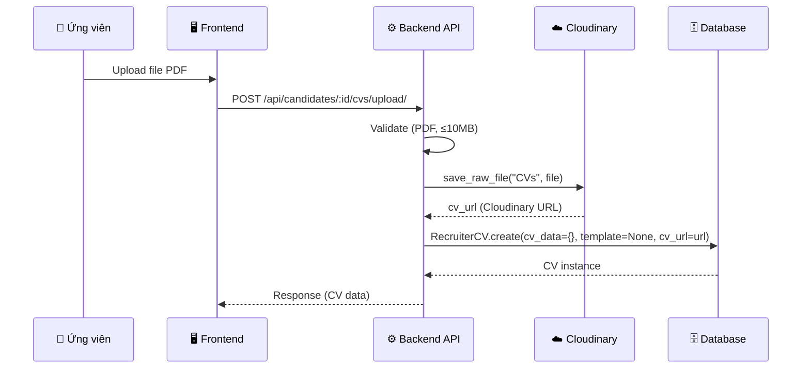
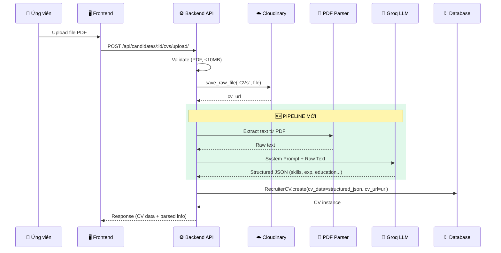
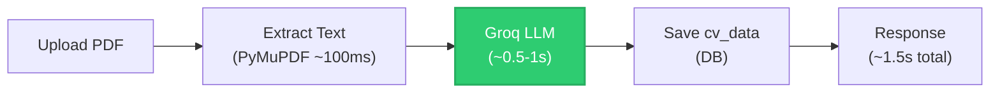
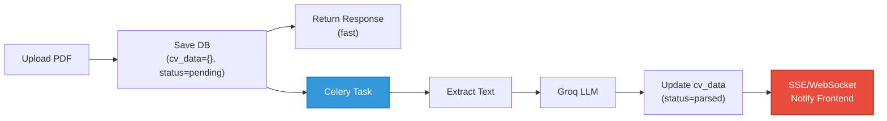
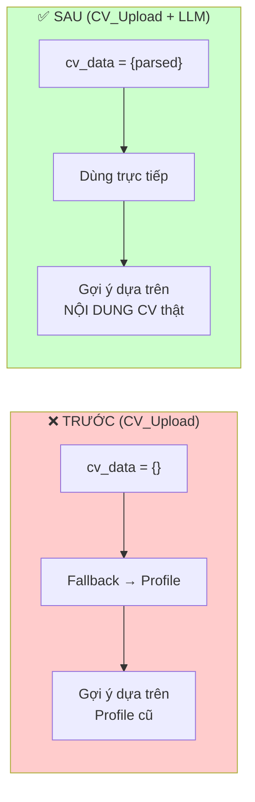

# 📋 Phân Tích Luồng Upload CV & Giải Pháp LLM (Groq API)

## 1. Hiện Trạng Luồng Upload CV

### 1.1 Sơ đồ luồng hiện tại



### 1.2 Các file liên quan

| Layer | File | Vai trò |
|-------|------|---------|
| Frontend | [cvService.ts](file:///Users/capkimkhanh/Documents/DUT/JOBIO/frontend/src/services/cvService.ts#L47-L56) | `uploadPdfFile()` - gửi file PDF lên backend |
| Backend View | [views.py](file:///Users/capkimkhanh/Documents/DUT/JOBIO/backend/apps/candidate/recruiter_cvs/views.py#L219-L259) | `upload_cv()` - validate & gọi service |
| Backend Service | [recruiter_cvs.py](file:///Users/capkimkhanh/Documents/DUT/JOBIO/backend/apps/candidate/recruiter_cvs/services/recruiter_cvs.py#L271-L303) | `upload_cv_pdf()` - upload Cloudinary + tạo DB record |
| Model | [models.py](file:///Users/capkimkhanh/Documents/DUT/JOBIO/backend/apps/candidate/recruiter_cvs/models.py#L4-L43) | `RecruiterCV` - lưu trữ CV |
| URL | [urls.py](file:///Users/capkimkhanh/Documents/DUT/JOBIO/backend/apps/candidate/recruiter_cvs/urls.py#L17-L22) | `POST /upload/` |

### 1.3 Vấn đề cốt lõi

> [!CAUTION]
> **CV Upload KHÔNG ĐƯỢC XỬ LÝ NỘI DUNG.** File PDF được upload "as-is" lên Cloudinary mà KHÔNG qua bất kỳ bước trích xuất text hay phân tích nào.

Khi upload CV:

```python
# recruiter_cvs.py:294-302 — Luồng upload hiện tại
cv = RecruiterCV.objects.create(
    recruiter=recruiter,
    template=None,       # ← Không có template
    cv_name=cv_name,
    cv_data={},          # ← cv_data HOÀN TOÀN RỖNG {}
    cv_url=cv_url,       # ← Chỉ lưu URL Cloudinary
    is_default=False,
    is_public=True,
)
```

**Hệ quả**: `cv_data = {}` → Khi gợi ý công việc, hệ thống **không có dữ liệu skills, experience, position** từ CV upload.

---

## 2. Phân Tích Luồng Gợi Ý Công Việc Hiện Tại

### 2.1 Khi có `cv_id` → `get_job_suggestions_for_cv()`

Tại [jobs.py:472-589](file:///Users/capkimkhanh/Documents/DUT/JOBIO/backend/apps/recruitment/jobs/selectors/jobs.py#L472-L589):

```mermaid
flowchart TD
    A["GET /api/jobs/recommendations/?cv_id=X"] --> B{CV Upload?<br/>template=None & cv_data={}}
    B -->|Yes - CV_Upload| C["Fallback: Dùng Recruiter Profile<br/>current_position + RecruiterSkills"]
    B -->|No - CV_Template| D["Dùng cv_data<br/>personal.current_position + skills"]
    C --> E["Scoring Algorithm"]
    D --> E
    E --> F["Title Similarity: 40%<br/>Salary Match: 30%<br/>Skill Match: 30%"]
    F --> G["Trả về danh sách jobs + match_score"]
    
    style C fill:#ff6b6b,stroke:#c0392b,stroke-width:2px,color:#fff
    style B fill:#f39c12,stroke:#d68910,stroke-width:2px,color:#fff
```

> [!WARNING]
> **Điểm yếu nghiêm trọng**: Với CV_Upload, hệ thống hoàn toàn **bỏ qua nội dung thực sự** trong file PDF và fallback về Recruiter Profile — dẫn đến gợi ý công việc **không phản ánh** CV mà user upload.

### 2.2 Scoring Algorithm hiện tại

```python
# jobs.py:468 — Trọng số hiện tại
total = (title_score * 0.40 + salary_score * 0.30 + skill_score * 0.30) * 100
```

| Factor | Weight | Nguồn dữ liệu CV_Upload | Vấn đề |
|--------|--------|-------------------------|---------|
| Title Similarity | 40% | `recruiter.current_position` | Không lấy từ CV thật |
| Salary Match | 30% | `recruiter.desired_salary_*` | OK (profile data) |
| Skill Match | 30% | `RecruiterSkill` (profile) | Không match skills trong CV PDF |

---

## 3. Giải Pháp Đề Xuất: LLM-Powered CV Parsing

### 3.1 Tổng quan kiến trúc



### 3.2 Pipeline chi tiết — 3 Giai đoạn

#### Giai đoạn 1: PDF → Text (Extract)

**Thư viện đề xuất**:

| Thư viện | Ưu điểm | Nhược điểm | Recommend |
|----------|---------|------------|-----------|
| `PyMuPDF (fitz)` | Nhanh, hỗ trợ layout tốt, extract text có structure | Cần cài C lib | ⭐ **Ưu tiên #1** |
| `pdfminer.six` | Pure Python, reliable | Chậm hơn PyMuPDF | ✅ Backup |
| `pypdf` | Nhẹ, dễ dùng | Xử lý layout kém | ❌ |

**Code mẫu**:

```python
import fitz  # PyMuPDF

def extract_text_from_pdf(file_bytes: bytes) -> str:
    """Extract text từ PDF, giữ nguyên cấu trúc layout."""
    doc = fitz.open(stream=file_bytes, filetype="pdf")
    pages_text = []
    for page in doc:
        pages_text.append(page.get_text("text"))
    doc.close()
    return "\n\n".join(pages_text)
```

#### Giai đoạn 2: Text → Structured Data (LLM)

**System Prompt thiết kế chuyên biệt**:

```python
CV_PARSING_SYSTEM_PROMPT = """
Bạn là một chuyên gia phân tích CV/Resume. Nhiệm vụ của bạn là trích xuất thông tin 
từ CV dạng text thô và trả về JSON có cấu trúc chính xác theo schema bên dưới.

QUY TẮC:
1. Chỉ trích xuất thông tin CÓ trong CV, KHÔNG bịa ra thông tin.
2. Nếu một trường không tìm thấy, để giá trị mặc định (chuỗi rỗng, mảng rỗng, null).
3. Skills phải được chuẩn hóa (viết hoa chữ cái đầu, tách riêng từng skill).
4. Dates theo format ISO 8601 (YYYY-MM-DD) nếu có đủ info, nếu chỉ có tháng/năm thì YYYY-MM-01.
5. Trả về JSON DUY NHẤT, không kèm markdown hay text nào khác.

JSON SCHEMA:
{
  "personal": {
    "full_name": "string",
    "email": "string",
    "phone": "string",
    "current_position": "string",
    "bio": "string (tóm tắt bản thân nếu có)",
    "years_of_experience": number | null
  },
  "location": {
    "city": "string",
    "country": "string"
  },
  "links": {
    "linkedin": "string",
    "github": "string",
    "portfolio": "string"
  },
  "skills": [
    {
      "name": "string (tên skill đã chuẩn hóa)",
      "proficiency_level": "beginner|intermediate|advanced|expert",
      "years_of_experience": number | null
    }
  ],
  "education": [
    {
      "school_name": "string",
      "degree": "string",
      "field_of_study": "string",
      "start_date": "YYYY-MM-DD | null",
      "end_date": "YYYY-MM-DD | null",
      "is_current": boolean,
      "description": "string"
    }
  ],
  "experience": [
    {
      "company_name": "string",
      "job_title": "string",
      "start_date": "YYYY-MM-DD | null",
      "end_date": "YYYY-MM-DD | null",
      "is_current": boolean,
      "description": "string"
    }
  ],
  "certifications": [
    {
      "name": "string",
      "issuing_organization": "string",
      "issue_date": "YYYY-MM-DD | null",
      "expiry_date": "YYYY-MM-DD | null"
    }
  ],
  "projects": [
    {
      "name": "string",
      "description": "string",
      "technologies": ["string"],
      "start_date": "YYYY-MM-DD | null",
      "end_date": "YYYY-MM-DD | null"
    }
  ],
  "languages": [
    {
      "name": "string",
      "proficiency_level": "basic|intermediate|advanced|native"
    }
  ]
}
"""
```

> [!IMPORTANT]
> Schema JSON output **hoàn toàn tương thích** với `cv_data` schema hiện có trong `build_cv_data_from_profile()` tại [recruiter_cvs.py:32-157](file:///Users/capkimkhanh/Documents/DUT/JOBIO/backend/apps/candidate/recruiter_cvs/services/recruiter_cvs.py#L32-L157). Điều này đảm bảo không cần sửa scoring algorithm hay UI.

#### Giai đoạn 3: Lưu & Matching

Structured JSON được lưu vào `cv_data` → Scoring algorithm tại [jobs.py:472-589](file:///Users/capkimkhanh/Documents/DUT/JOBIO/backend/apps/recruitment/jobs/selectors/jobs.py#L472-L589) sẽ **tự động hoạt động** vì:

- `cv_data.personal.current_position` → Title Similarity (40%)
- `cv_data.skills[].name` → Skill Match (30%)
- `recruiter.desired_salary_*` → Salary Match (30%) — không thay đổi

---

## 4. Tại Sao Chọn Groq API?

### 4.1 So sánh các LLM Provider

| Tiêu chí | Groq | OpenAI | Google Gemini | Self-hosted |
|----------|------|--------|---------------|-------------|
| **Tốc độ** | ⚡ **~500 tok/s** (nhanh nhất) | ~100 tok/s | ~150 tok/s | Phụ thuộc GPU |
| **Chi phí** | 💰 **Free tier rộng rãi** | $0.15-$5/1M tokens | Free nhưng giới hạn | Chi phí GPU cao |
| **Latency** | **~0.3-1s** cho CV parsing | 2-5s | 1-3s | 1-10s |
| **Models** | Llama 3.3 70B, Mixtral | GPT-4o, GPT-4o-mini | Gemini 2.0 | Llama, Mistral |
| **JSON Mode** | ✅ Hỗ trợ | ✅ Hỗ trợ | ✅ Hỗ trợ | Tùy model |
| **Rate Limit (free)** | 30 req/min, 14.4K req/day | Không free | 15 req/min | Unlimited |
| **Phù hợp CV parsing** | ⭐⭐⭐⭐⭐ | ⭐⭐⭐⭐ | ⭐⭐⭐⭐ | ⭐⭐⭐ |

### 4.2 Lý do Groq là lựa chọn tối ưu

1. **Tốc độ cực nhanh** — User upload CV và nhận kết quả gần như tức thì (~1s so với 3-5s OpenAI)
2. **Free tier đủ dùng** — 30 req/min, 14.4K req/day cho dự án đang phát triển
3. **Llama 3.3 70B** — Model open-source chất lượng cao, JSON output ổn định
4. **REST API đơn giản** — Tương thích OpenAI SDK format, dễ tích hợp
5. **Dự án đã có `google-genai`** trong [requirements.txt](file:///Users/capkimkhanh/Documents/DUT/JOBIO/backend/requirements.txt#L32) nhưng chưa sử dụng → Groq nhẹ hơn và phù hợp cho task này

### 4.3 Model recommend cho task CV parsing

| Model | Chất lượng | Tốc độ | Chi phí | Recommend |
|-------|-----------|--------|---------|-----------|
| `llama-3.3-70b-versatile` | ⭐⭐⭐⭐⭐ | Nhanh | $0.59/1M input | ⭐ **Production** |
| `llama-3.1-8b-instant` | ⭐⭐⭐ | Rất nhanh | $0.05/1M input | ✅ Backup/Budget |
| `mixtral-8x7b-32768` | ⭐⭐⭐⭐ | Nhanh | $0.24/1M input | ✅ Alternative |

---

## 5. Kiến Trúc Triển Khai Chi Tiết

### 5.1 Cấu trúc file đề xuất

```
backend/apps/candidate/recruiter_cvs/
├── services/
│   ├── recruiter_cvs.py          # Existing — sửa upload_cv_pdf()
│   └── cv_parser.py              # 🆕 PDF parsing + LLM extraction
├── models.py                     # Thêm parsed_status field
├── views.py                      # Sửa upload_cv() 
└── ...
```

### 5.2 Flow xử lý — 2 Strategy

#### Strategy A: Đồng bộ (Synchronous) — Đơn giản



**Ưu điểm**: Đơn giản, user nhận kết quả ngay.
**Nhược điểm**: Response chậm hơn (~1.5s thay vì <0.5s).

#### Strategy B: Bất đồng bộ (Async via Celery) — Scalable



**Ưu điểm**: Response nhanh, scalable, không block user.
**Nhược điểm**: Phức tạp hơn, cần Celery + notification.

> [!TIP]
> **Khuyến nghị**: Bắt đầu với **Strategy A (Đồng bộ)** vì Groq rất nhanh (~1s), tổng response chỉ ~1.5-2s — hoàn toàn chấp nhận được. Khi scale lên mới chuyển sang Strategy B.

### 5.3 Code Implementation Blueprint

```python
# cv_parser.py — Module mới

import json
import fitz  # PyMuPDF
import requests
import logging

from django.conf import settings

logger = logging.getLogger(__name__)

GROQ_API_URL = "https://api.groq.com/openai/v1/chat/completions"

CV_PARSING_SYSTEM_PROMPT = """..."""  # System prompt ở Section 3.2

def extract_text_from_pdf(file_bytes: bytes) -> str:
    """Extract text từ PDF bytes."""
    doc = fitz.open(stream=file_bytes, filetype="pdf")
    pages = [page.get_text("text") for page in doc]
    doc.close()
    
    text = "\n\n".join(pages).strip()
    
    # Giới hạn text length để tránh token overflow
    MAX_CHARS = 15000  # ~4K tokens
    if len(text) > MAX_CHARS:
        text = text[:MAX_CHARS]
    
    return text


def parse_cv_with_llm(raw_text: str) -> dict:
    """Gửi text CV đến Groq LLM và nhận structured JSON."""
    
    if not raw_text or len(raw_text.strip()) < 50:
        logger.warning("CV text too short for LLM parsing")
        return {}
    
    headers = {
        "Authorization": f"Bearer {settings.GROQ_API_KEY}",
        "Content-Type": "application/json",
    }
    
    payload = {
        "model": "llama-3.3-70b-versatile",
        "messages": [
            {"role": "system", "content": CV_PARSING_SYSTEM_PROMPT},
            {"role": "user", "content": f"Phân tích CV sau:\n\n{raw_text}"},
        ],
        "temperature": 0.1,  # Deterministic output
        "max_tokens": 4096,
        "response_format": {"type": "json_object"},
    }
    
    try:
        resp = requests.post(
            GROQ_API_URL,
            headers=headers,
            json=payload,
            timeout=30,
        )
        resp.raise_for_status()
        
        content = resp.json()["choices"][0]["message"]["content"]
        parsed = json.loads(content)
        
        # Validate required fields
        if not isinstance(parsed, dict):
            return {}
        
        return parsed
        
    except requests.exceptions.Timeout:
        logger.error("Groq API timeout")
        return {}
    except (json.JSONDecodeError, KeyError) as e:
        logger.error(f"Failed to parse LLM response: {e}")
        return {}
    except requests.exceptions.RequestException as e:
        logger.error(f"Groq API error: {e}")
        return {}


def process_cv_pdf(file_bytes: bytes) -> dict:
    """Pipeline chính: PDF bytes → Structured cv_data."""
    
    # Step 1: Extract text
    raw_text = extract_text_from_pdf(file_bytes)
    
    if not raw_text.strip():
        logger.warning("No text extracted from PDF (might be image-based)")
        return {}
    
    # Step 2: LLM parsing
    cv_data = parse_cv_with_llm(raw_text)
    
    return cv_data
```

### 5.4 Sửa đổi `upload_cv_pdf()` hiện tại

```diff
 @transaction.atomic
 def upload_cv_pdf(recruiter, file, cv_name: str = None) -> RecruiterCV:
+    # Đọc file bytes TRƯỚC KHI upload (vì file.read() chỉ dùng 1 lần)
+    file_bytes = file.read()
+    
     # Upload lên Cloudinary
-    content_file = ContentFile(file.read(), name=file.name)
+    content_file = ContentFile(file_bytes, name=file.name)
     cv_url = save_raw_file("CVs", content_file, f"cv_upload_{recruiter.id}")
 
+    # 🆕 Parse CV content with LLM
+    from .cv_parser import process_cv_pdf
+    cv_data = process_cv_pdf(file_bytes)
+    
     if not cv_name:
         cv_name = file.name
         if cv_name.lower().endswith(".pdf"):
             cv_name = cv_name[:-4]
 
     cv = RecruiterCV.objects.create(
         recruiter=recruiter,
         template=None,
         cv_name=cv_name,
-        cv_data={},
+        cv_data=cv_data,        # ← Giờ có structured data!
         cv_url=cv_url,
         is_default=False,
         is_public=True,
     )
     return cv
```

---

## 6. Cấu Hình Cần Thêm

### 6.1 Environment Variables

```bash
# .env
GROQ_API_KEY=gsk_your_groq_api_key_here
GROQ_MODEL=llama-3.3-70b-versatile
```

### 6.2 Django Settings

```python
# settings.py
GROQ_API_KEY = os.getenv("GROQ_API_KEY", "")
GROQ_MODEL = os.getenv("GROQ_MODEL", "llama-3.3-70b-versatile")
```

### 6.3 Requirements mới

```
# requirements.txt — Thêm
PyMuPDF>=1.24.0      # PDF text extraction
groq>=0.9.0           # Groq Python SDK (optional, có thể dùng requests)
```

---

## 7. Xử Lý Edge Cases

### 7.1 Các trường hợp đặc biệt

| Trường hợp | Xử lý |
|-------------|--------|
| **CV dạng ảnh (scan)** | PyMuPDF không extract được text → `cv_data = {}` → fallback về profile (như hiện tại) |
| **Groq API down** | Graceful degradation: lưu `cv_data = {}`, log error, CV vẫn được upload bình thường |
| **Rate limit exceeded** | Retry với exponential backoff (3 lần), nếu vẫn fail → fallback |
| **CV quá dài (>15K chars)** | Truncate text, chỉ lấy phần đầu (thường chứa thông tin quan trọng nhất) |
| **JSON parse fail** | Fallback `cv_data = {}`, log raw response để debug |
| **CV tiếng Việt** | Llama 3.3 70B hỗ trợ tiếng Việt tốt, system prompt song ngữ |

### 7.2 Monitoring & Observability

```python
# Thêm parsed_status vào model (optional, rất hữu ích)
class RecruiterCV(models.Model):
    # ... existing fields ...
    parsed_status = models.CharField(
        max_length=20,
        choices=[
            ("none", "Chưa parse"),        # CV_Template (không cần parse)
            ("pending", "Đang xử lý"),      # Đang gửi LLM
            ("parsed", "Đã parse"),          # Parse thành công
            ("failed", "Parse thất bại"),    # LLM error
        ],
        default="none",
        verbose_name="Trạng thái parse CV",
    )
    parsed_at = models.DateTimeField(null=True, blank=True)
```

---

## 8. Tác Động Lên Hệ Thống Hiện Tại

### 8.1 Những gì KHÔNG cần sửa (Zero Breaking Changes)

| Component | Lý do |
|-----------|-------|
| `get_job_suggestions_for_cv()` | Đã kiểm tra `cv_data` rồi — nếu có data sẽ tự dùng, nếu rỗng vẫn fallback |
| `calculate_cv_job_match_score()` | Logic `is_cv_upload` check `cv_data` — nếu có data → dùng `cv_data`, bỏ qua fallback |
| `_cv_skill_tokens()` | Đã parse `cv_data.skills[].name` |
| `_title_similarity_score()` | Đã dùng `cv_data.personal.current_position` |
| Frontend `cvService` | Không thay đổi API contract |
| Scoring weights | Giữ nguyên 40/30/30 |

### 8.2 Cải thiện tức thì sau khi triển khai



---

## 9. Chi Phí Ước Tính

### Groq Free Tier

| Metric | Giá trị |
|--------|---------|
| Rate | 30 requests/min |
| Daily | 14,400 requests/day |
| Input tokens | 6,000 tokens/min |
| Output tokens | 6,000 tokens/min |

### Ước tính cho JOBIO

| Scenario | CV uploads/ngày | Token/CV | Chi phí |
|----------|----------------|----------|---------|
| MVP/Dev | 10-50 | ~2K input + 1K output | **$0 (Free tier)** |
| Production nhỏ | 100-500 | ~2K input + 1K output | **$0 (Free tier)** |
| Production lớn | 1,000+ | ~2K input + 1K output | ~$0.59-1.77/ngày |

> [!NOTE]
> Với 500 CV/ngày, chi phí Groq vẫn là **$0** (nằm trong free tier). Chỉ cần trả phí khi vượt >14,400 req/ngày — rất unlikely cho giai đoạn đầu.

---

## 10. Kế Hoạch Triển Khai (Nếu Đồng Ý)

### Phase 1: Core Pipeline (1-2 ngày)
- [ ] Tạo `cv_parser.py` (PDF extract + Groq LLM)
- [ ] Cập nhật `upload_cv_pdf()` tích hợp pipeline
- [ ] Thêm `GROQ_API_KEY` vào settings
- [ ] Thêm `PyMuPDF` vào requirements

### Phase 2: Model & Monitoring (0.5 ngày)
- [ ] Thêm `parsed_status` field vào `RecruiterCV` model
- [ ] Migration
- [ ] Logging & error tracking

### Phase 3: Testing & Validation (1 ngày)
- [ ] Unit tests cho `cv_parser.py`
- [ ] Integration test với CV mẫu (tiếng Việt + tiếng Anh)
- [ ] Test edge cases (ảnh scan, file lỗi, API timeout)

### Phase 4: Enhancement (Tùy chọn)
- [ ] Celery async pipeline (Strategy B)
- [ ] Re-parse existing CV_Uploads
- [ ] Admin UI hiển thị parsed_status

---

## 11. Open Questions

> [!IMPORTANT]
> **Cần xác nhận từ bạn trước khi triển khai:**

1. **Groq API Key** — Bạn đã có Groq API key chưa? (Đăng ký free tại [console.groq.com](https://console.groq.com))

2. **Synchronous vs Async** — Bạn muốn xử lý đồng bộ (đơn giản, ~1.5s response) hay bất đồng bộ qua Celery (phức tạp hơn nhưng response nhanh)?

3. **CV dạng ảnh (scan)** — Có cần hỗ trợ OCR cho CV scan (ảnh) không? Nếu có, cần thêm `pytesseract` + Tesseract OCR engine.

4. **Re-parse CV cũ** — Có muốn chạy pipeline cho các CV_Upload đã tồn tại trong DB không?

5. **Model selection** — Muốn dùng `llama-3.3-70b-versatile` (chất lượng cao) hay `llama-3.1-8b-instant` (nhanh & rẻ hơn)?
